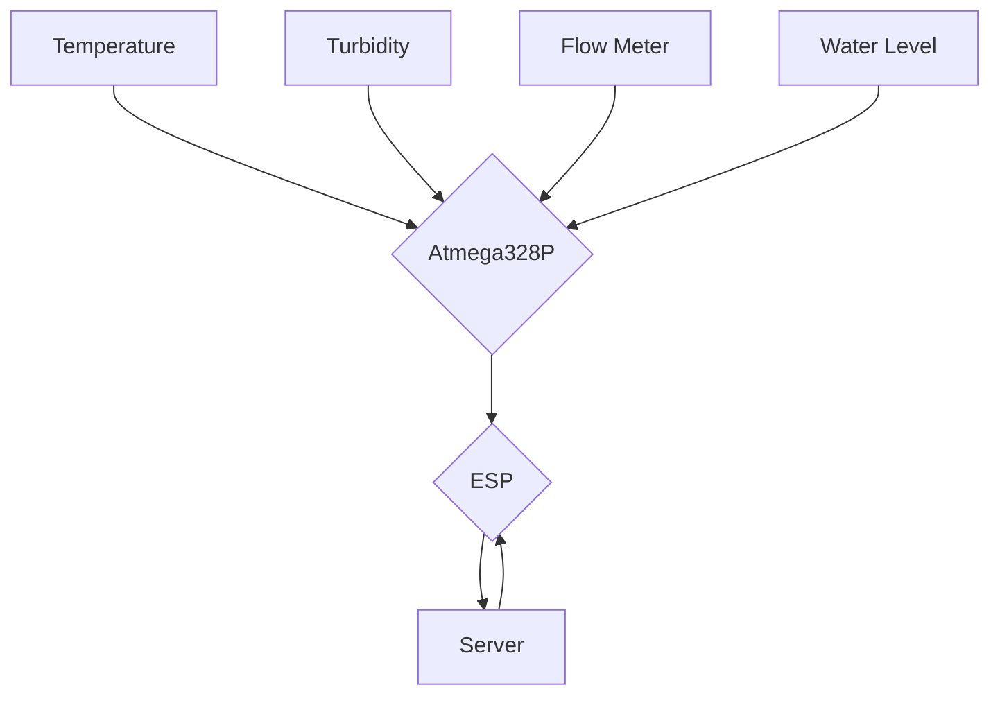

## Aquarium Wifi Sensor - Top Level

```mermaid
graph TD;
    Micro{Atmega328P}
    Wifi{ESP}
    
    Serv[Server]
    
    Temp[Temperature]
    Turb[Turbidity]
    Flow[Flow Meter]
    Lev[Water Level]
    
    Temp --> Micro
    Turb --> Micro
    Flow --> Micro
    Lev --> Micro
    
    Micro --> Wifi
    Wifi --> Serv
    Serv --> Wifi
    
```