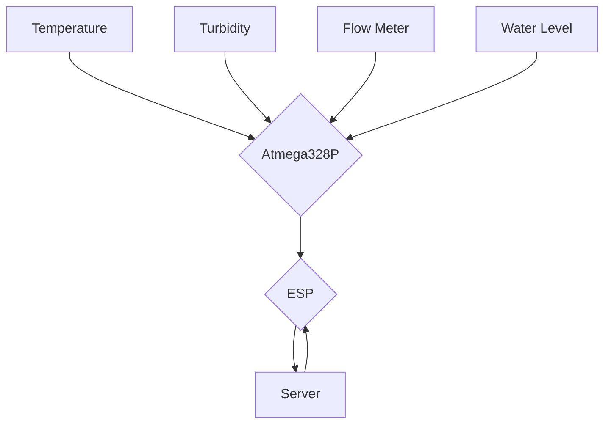

# Plans for Project
A wifi aquarium monitor that has an array of sensors to data from the aquarium to monitor filter and water health

## Paramaters to capture
* Water temp
* Water PH
* Filter flow
* Water turbidity
* Salinity 
* Video?
* Light level? (Could be used to determine algae growth on surfaces(lid, exterior, etc))
* Particulates

## Required Hardware
### Microcontrollers
* Arduino ATMEGA328P
* ESP2866
### Sensors
* Thermometer 
* PH sensor
* Flow meter
* Turbidity Sensor
* Salinity Sensor
* Camera

# Plan
## Proof of Concept
A prototype will be made using arduino code and jumper wires and default arduino boards

## Aquarium Wifi Sensor - Top Level

